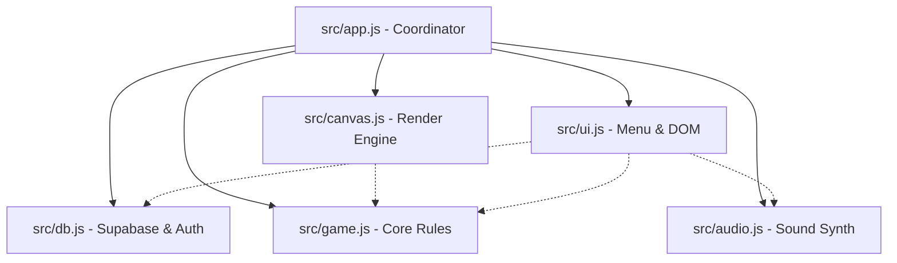

# Детальний аналіз та план рефакторингу моноліту `app.js`

Цей документ містить глибокий технічний аналіз існуючого файлу [app.js](file:///d:/Antigravity%20projects/Squares%20game/app.js) (2414 рядків) та детальний план його поділу на окремі модулі перед інтеграцією мережевого режиму через Supabase.

---

## 📊 Глобальний стан гри (`state`)
Вся логіка гри зав'язана на одному об'єкті `state`. Для мультиплеєра нам потрібно чітко розрізняти, який стан є **локальним (тимчасовим)**, а який — **глобальним (синхронізованим через БД)**.

| Змінна | Опис | Тип стану | Синхронізація через Supabase |
| :--- | :--- | :---: | :--- |
| `activePlayer` | ID активного гравця (1-6) | Глобальний | Записується в `game_states.active_player` |
| `playersCount` | Кількість гравців (2-6) | Глобальний | Налаштування кімнати `rooms.players_count` |
| `mapType` | Стиль карти ("classic", "asteroids", ...) | Глобальний | Налаштування кімнати `rooms.map_type` |
| `playerNames` | Об'єкт з іменами гравців `{ 1: "Name", ... }` | Глобальний | Зчитується з таблиці `players` |
| `playerColors` | Об'єкт з кольорами `{ 1: "cyan", ... }` | Глобальний | Зчитується з таблиці `players` |
| `gridSize` | Розмір сітки (10-80) | Глобальний | Налаштування кімнати `rooms.grid_size` |
| `board` | 2D масив ігрового поля (0 = порожньо, 1-6 = гравці, 7 = стіни) | Глобальний | Таблиця `game_states.board` |
| `currentRoll` | Масив поточного кидка `[die1, die2]` | Глобальний | Таблиця `game_states.current_roll` |
| `hasRolled` | Чи кидав гравець кубики в поточному ходу | Глобальний | Таблиця `game_states.has_rolled` |
| `isRotated` | Чи перевернута фігура (ширина <-> висота) | **Локальний** | Ні (передається лише фінальна координата) |
| `consecutivePasses` | Кількість пасів поспіль (для визначення кінця гри) | Глобальний | Таблиця `game_states.consecutive_passes` |
| `isGameOver` | Флаг завершення матчу | Глобальний | Таблиця `game_states.is_game_over` |
| `rollsCount` | Кількість ходів кожного гравця | Глобальний | Статистика сесії |
| `soundMuted` | Чи вимкнено звук | **Локальний** | Зберігається в `localStorage` клієнта |
| `doubleSizeMultiplier` | Множники ходів для дублів `{ 1: 1.0, 2: 2.0... }` | Глобальний | Таблиця `game_states` |
| `consecutiveSkippedTurns` | Пропуски ходів для Cosmic Comeback | Глобальний | Таблиця `game_states` |
| `activeSpecialMove` | Поточний спецхід (`'wall-drawing'`, `'custom36-drawing'`, `'breach-overwriting'`, `'1x1-anywhere'`) | Глобальний | Таблиця `game_states.active_special_move` |
| `customCellsToPlace` | Залишок клітинок для малювання | **Локальний** | Тимчасовий стан малювання |
| `customCellsPlaced` | Масив координат намальованих клітинок `[{r, c}]` | **Локальний** | Надсилається в БД лише при підтвердженні |
| `debugNextRoll` | Зневаджувальний кидок (чит-код `D`) | **Локальний** | Тільки для дебагу на клієнті |

---

## ⚙️ Функціональні підсистеми

Код `app.js` розділений на 7 логічних блоків. Нижче наведено детальний опис кожного з них та його логічні межі.

### 1. Звуковий рушій (Audio Engine)
* **Функції:** `initAudio()`, `synthSound()`, `playRollTick()`, `playPlaceBlockSound()`, `playHoverTick()`, `playErrorTone()`, `playWallSound()`, `playBreachSound()`, `playVictoryFanfare()`.
* **Технологія:** Web Audio API. Динамічно створює `OscillatorNode` та `GainNode` для кожної звукової події.
* **Особливість:** Не використовує зовнішні файли (wav/mp3), генерує унікальні хвильові ефекти в реальному часі. Звуки мають бути доступні іншим модулям.

### 2. Конструктор поля та Карт (Map Builder)
* **Функції:** `generateMapObstacles()`, `resetBoard()`, `getStartingCorner()`.
* **Мапи:**
  * `classic`: пуста сітка.
  * `asteroids`: випадково розміщує 5% кам'яних блоків (стін), уникаючи стартових зон гравців.
  * `cross`: створює хрест посередині поля з проходом в центрі.
  * `quadrants`: розміщує чотири великі квадратні колони.
  * `blackhole`: створює гравітаційне ядро $4\times 4$ стін у центрі сітки.

### 3. Рушій правил та Валідація (Rules & Verification)
Це ядро гри, яке ми будемо дублювати на сервері (в БД PostgreSQL) для максимальної безпеки.
* **Функції:** `isValidPlacement(r, c, width, height, player)`, `hasAnyValidMoves(player, roll)`.
* **Правила adjacency (сусідства):**
  * Перший хід: фігура обов'язково має накривати стартовий кут гравця (або сусідити з напарником у командному режимі).
  * Наступні ходи: фігура має дотикатися хоча б однією стороною (не діагоналлю) до клітинок своєї команди.
  * Стіни (`7`) або власні клітинки накривати не можна.
  * Клітинки опонентів накривати не можна, окрім спецрежиму `breach-overwriting` (Tectonic Breach, дубль 5).
  * `1x1-anywhere` (Cosmic Seed) ігнорує правила дотику та ставиться в будь-яку пусту клітинку.

### 4. Робота з дублями (Doubles Rules)
* **Функції:** `handleDoubleRollSequence(doubleVal)`, `showDoublesModal()`, `selectNormalDoublesMove()`, `selectWallDrawingMove()`, `confirmDrawShape()`, `resetDrawShape()`, `isDraftContiguous()`, `validateFinalDraft()`, `hasAnyDrawingMoves()`.
* **Особливості малювання:**
  * Для малювання стіни (4 клітини) та вільної фігури (36 клітин) гра переходить у спеціальний режим драфту.
  * Драфт зберігається в `state.customCellsPlaced`. Гравці малюють за допомогою затискання лівої кнопки миші (drag) або видаляють правою (erase drag).
  * При підтвердженні перевіряється зв'язність малюнка (DFS алгоритм у `isDraftContiguous()`).

### 5. Canvas Рендеринг (Canvas Drawing Loop)
* **Функції:** `resizeCanvas()`, `drawBoard()`, `drawCornerIndicator()`, `canvasLoop()`.
* **Особливості:**
  * Підтримує Retina масштабування через `window.devicePixelRatio`.
  * Малює сітку, захоплені клітинки, перешкоди, стартові кути, прев'ю фігури, що ховерить (з пульсуючим glow ефектом), та індекси клітинок при малюванні драфту.
  * Рендер працює в циклі `requestAnimationFrame` з частотою екрану.

### 6. Конфетті (Confetti Physics)
* **Функції:** `startConfettiEffect()`, `confettiLoop()`.
* **Особливість:** Малює святкові частинки на весь екран при перемозі, використовуючи окремий прозорий Canvas `victory-confetti-canvas`.

### 7. Обробники подій та UI інтерфейс (UI Event Listeners)
* **Функції:** `setupEventListeners()`, `showToast()`, `switchPlayer()`, `tallyGridScores()`, `endMatch()`.
* **Контролери:** Кнопки кидка, повороту фігури, пасу, скидання, вибір розмірів, команд, режимів карт.

---

## 📦 План розподілу на JS-модулі (Modular Structure)

Пропонується наступний поділ коду на ES6-модулі в папці `src/`:

### 📋 1. `src/audio.js` (Звуки)
* **Вміст:** `audioCtx`, `synthSound`, усі специфічні звукові функції (`playRollTick`, `playVictoryFanfare` тощо).
* **Експорт:** Об'єкт `AudioEngine` з методами відтворення звуків та налаштуванням `setMuted(boolean)`.

### 🎨 2. `src/canvas.js` (Візуалізація)
* **Вміст:** Змінні `ctx`, `gridCellSize`, `gridWidth`, функції `resizeCanvas`, `drawBoard`, `drawCornerIndicator`, `canvasLoop`.
* **Вхідні дані:** Отримує об'єкт `state` гри та `hoverState`.
* **Експорт:** Функція `initCanvas(canvasEl, state, hoverState)`, `resizeCanvas`, `stopLoop`.

### 🧠 3. `src/game.js` (Правила та стан)
* **Вміст:** Функції `isValidPlacement`, `hasAnyValidMoves`, `getStartingCorner`, `getPlayerTeam`, `generateMapObstacles`, `isDraftContiguous`, `validateFinalDraft`, `hasAnyDrawingMoves`.
* **Особливість:** Чистий модуль логіки, не зв'язаний з DOM та Canvas безпосередньо.
* **Експорт:** Клас/об'єкт `GameEngine` для перевірки ходів та обчислення нового стану.

### 🌐 4. `src/db.js` (Зв'язок із Supabase)
* **Вміст:** Ініціалізація `supabaseClient`, авторизація Google Auth, Presence (перевірка онлайну), Broadcast (передача ховеру опонентів), Realtime-підписка на зміни `game_states`.
* **Експорт:** Методи `loginWithGoogle()`, `createRoom()`, `joinRoom()`, `sendHoverState()`, `subscribeToRoom()`, `submitMove()`.

### 🖥️ 5. `src/ui.js` (Користувацький інтерфейс)
* **Вміст:** Керування DOM елементами, відображення екрану Setup/Lobby/Game, показ Toast, вибір кольорів, оновлення Scoreboard, виклик вікон вибору дублів.
* **Експорт:** Метод `initUI(state, callbacks)`, що зв'язує кліки кнопок із викликами рушія гри чи бази даних.

### 🚀 6. `src/app.js` (Координатор)
* **Вміст:** Точка входу. Поєднує всі модулі: при отриманні оновлень з `db.js` оновлює локальний `state` у `game.js`, дає команду `canvas.js` на перемальовування та запускає звуки через `audio.js`.

---

## ⚡ Особливості синхронізації станів у мультиплеєрі

Для того, щоб перехід на мультиплеєр відбувся безшовно, ми врахуємо такі нюанси:

1. **Синхронізація Ховеру супротивника:**
   Коли гравець водить мишкою по сітці, `src/canvas.js` визначає координати, `src/db.js` передає їх через Supabase Broadcast іншому гравцю. Той відображає напівпрозору фігуру з іншим кольором (наприклад, кольором опонента).
   
2. **Скасування ходу та Паси:**
   Якщо гравець натискає "Pass", це має записуватися в БД. Якщо всі гравці по черзі пасують, тригер у БД або клієнтська перевірка виявляє кінець гри, змінює статус кімнати на `finished` та підраховує переможця.

3. **Синхронізація звуків:**
   Коли опонент кидає кубики або ставить фігуру, інші гравці повинні чути відповідний звук (`playRollTick`, `playPlaceBlockSound`). Це буде реалізовано через прослуховування подій зміни стану в Supabase Realtime — при зміні поля програється звук розміщення фігури.
